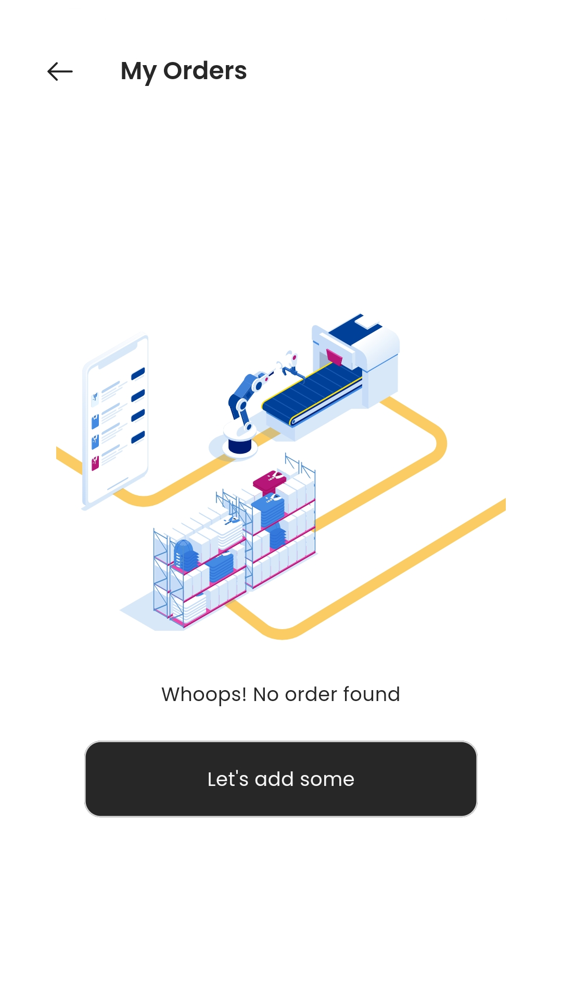

# Shoe Spotter

Shoe Spotter is a cutting-edge mobile application designed to help users discover and track their favorite shoes. Whether you're a sneakerhead, a casual shopper, or looking for the latest trends, Shoe Spotter provides a seamless experience for finding, reviewing, and purchasing shoes.

## Features

- **Adaptive UI**: Automatically adjusts screen and font sizes for a consistent experience across devices.
- **State Management**: Efficient and robust state management using GetX and Equatable.
- **Dependency Injection**: Simplified dependency injection with GetIt.
- **Utility Packages**: Includes packages for internationalization, URL launching, logging, native splash screens, page indicators, animations, and shimmering effects.
- **Icons**: Extensive icon library with Iconsax.
- **Product-Specific Features**: Readmore for expandable text, rating bar for reviews, progress indicators, and carousel sliders for showcasing products.
- **Local Storage**: Persistent storage using GetStorage.
- **Firebase Integration**: Comprehensive Firebase support for storage, core services, Firestore, authentication, and Google sign-in.
- **Image Handling**: Image picker for selecting images and cached network image for efficient image loading.
- **Network Utilities**: Internet connection checker and Dio for network requests.
- **Payment Gateway**: Secure payment processing with Flutter Stripe.

The main packages used in the project:

```yaml
# Adapting screen and font size
flutter_screenutil: ^5.9.0

# State management
get: ^4.6.6
equatable: ^2.0.5

# Dependency injection
get_it: ^7.6.7

# Utility packages
intl: ^0.19.0
url_launcher: ^6.2.5
logger: ^2.2.0
flutter_native_splash: ^2.3.10
smooth_page_indicator: ^1.1.0
lottie: ^3.1.0
shimmer: ^3.0.0

# Icons
iconsax: ^0.0.8

# Product-specific packages
readmore: ^3.0.0
flutter_rating_bar: ^4.0.1
capped_progress_indicator: ^0.0.2
carousel_slider: ^4.2.1

# Local storage
get_storage: ^2.1.1

# Firebase
firebase_storage: ^11.5.5
firebase_core: ^2.27.0
cloud_firestore: ^4.15.8
firebase_auth: ^4.17.8
google_sign_in: ^6.2.1

# Image handling
image_picker: ^1.0.8
cached_network_image: ^3.3.1

# Network
internet_connection_checker: ^1.0.0+1
dio: ^5.4.3+1

# Payment gateway
flutter_stripe: ^10.1.1
```

## Screenshots:

<h3> 1- Login screen </h3>

<p align="center">
  
  
</p>

<h3> 2- SignUp screen </h3>

<p align="center">
  
  
</p>

<h3> 3- Forget Password screen and reset email</h3>

<p align="center">
  
  
  
</p>

<h3> 4- Home screen </h3>

<p align="center">
  
  
</p>
<p align="center">
  
  
</p>

<h3> 5- SubCategories Screen </h3>

<p align="center">
  
  
</p>

<h3> 6- store screen </h3>

<p align="center">
  
  
</p>

<p align="center">
  
  
</p>
<p align="center">
  
  
</p>

<h3> 7- Brand Screen</h3>

<p align="center">
  
  
</p>

<h3> 8- Wishlist Screen</h3>

<p align="center">
  
  
  
</p>

<h3> 9- Product Details Screen </h3>

<p align="center">
  
  
</p>
<p align="center">
  
  
</p>
<p align="center">
  
  
  
</p>

<h3> 10- All Products Screen </h3>

<p align="center">
  
  
</p>

<p align="center">
  
  
  
</p>
<h3> 11- Cart Screen </h3>

<p align="center">
  
  
</p>

<h3> 12- Order Screen </h3>

<p align="center">
  
  
  
</p>
<p align="center">
  
  
  
</p>
<p align="center">
  
  
</p

<h3> 13- Settings Screen </h3>

<p align="center">
  
  
</p>

<h3> 14- Addresses Screen </h3>

<p align="center">
  
  
</p>
<p align="center">
  
  
</p>

<h3> 15- Profile Screen </h3>

<p align="center">
  
  
</p>

## How to Use

**Step 1:**

Download or clone this repo by using the link below:

```
https://github.com/osamasabry9/T-ShoeSpotter-Flutter.git
```

**Step 2:**

Go to project root and execute the following command in console to get the required dependencies:

```
flutter pub get
flutter run
```

### Folder Structure

Here is the core folder structure which flutter provides.

```
flutter-app/
|- android
|- build
|- ios
|- lib
    |- app/
    |- core/
    |- features/
         |- auth/
         |- onboarding/
         |- Personalization/
         |- shop/
    |- firebase_options.dart
    |- main_development.dart
    |- main_production.dart
```
